# GTM Engine Blueprint

**A complete go-to-market engine I built from scratch for a UK healthtech company launching an AI product into the NHS.**

15 automation workflows. AI-powered pipeline management. An orchestration layer that deploys full outbound campaigns in under 5 minutes. One person. Zero existing pipeline.

---

## The Problem

- A brand-new AI product with **zero pipeline** and **zero brand awareness**
- A market (NHS) that is notoriously hard to sell into — long buying cycles, multi-stakeholder sign-off, strict information governance
- A founding GTM role — meaning I build everything: strategy, systems, automation, outbound, content, pilot management

**I needed to build a GTM engine that could find the right people, reach them with the right message, handle every response intelligently, and manage pilots from sign-up to case study — mostly on autopilot.**

---

## System Overview

> [Full GTM strategy](docs/strategy.md) · [Automation architecture](docs/automation-architecture.md) · [Pilot playbook](docs/pilot-playbook.md) · [ICP scoring](docs/scoring-criteria.md) · [Email methodology](docs/copy-framework.md)

```
┌─────────────────────────────────────────────────────────────────┐
│                    GTM AUTOMATION SUITE                          │
├─────────────────────────────────────────────────────────────────┤
│                                                                  │
│  SIGNAL INTELLIGENCE          ENGAGEMENT PIPELINE               │
│  ┌──────────────────┐         ┌──────────────────┐              │
│  │ NHS Jobs Monitor  │         │ LinkedIn Capture  │             │
│  │ Board Papers      │         │ Content Flywheel  │             │
│  │ Competitor Watch   │         │ Engagement Routes │             │
│  │ Leadership Track   │         │                   │             │
│  └────────┬─────────┘         └────────┬──────────┘             │
│           │                            │                         │
│           ▼                            ▼                         │
│  ┌──────────────────────────────────────────────────┐           │
│  │          SHARED OUTPUT LAYER                      │           │
│  │   CRM  ·  Email Campaigns  ·  Slack  ·  Sheets   │           │
│  └──────────────────────────────────────────────────┘           │
│                         │                                        │
│                         ▼                                        │
│  ┌──────────────────────────────────────────────────┐           │
│  │          REPLY MANAGEMENT                         │           │
│  │   AI classifies every reply → 6 different actions │           │
│  └──────────────────────────────────────────────────┘           │
│                         │                                        │
│                         ▼                                        │
│  ┌──────────────────────────────────────────────────┐           │
│  │          PILOT LIFECYCLE                          │           │
│  │   Onboarding → Health Checks → Milestones → Case │           │
│  │   Study                                           │           │
│  └──────────────────────────────────────────────────┘           │
│                                                                  │
│  INFRASTRUCTURE: Error handler watches everything               │
│                                                                  │
└─────────────────────────────────────────────────────────────────┘
```

---

## The Workflows

### Signal Intelligence

4 workflows that run on schedules and scan the NHS landscape for buying signals — job vacancies, board papers, competitor contracts, leadership changes. When a signal fires, the lead gets enriched and pushed to outbound automatically.

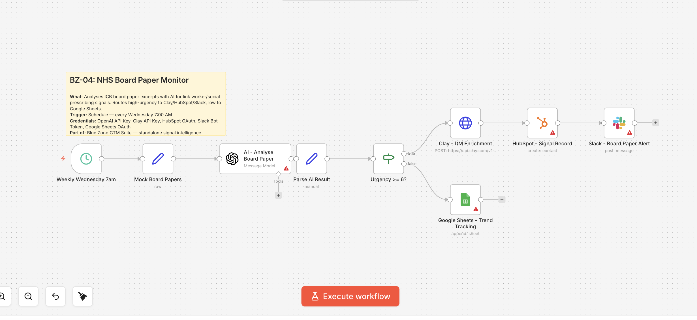
*Board Paper Monitor — AI reads ICB board papers, scores urgency, and routes high-priority signals to the team*

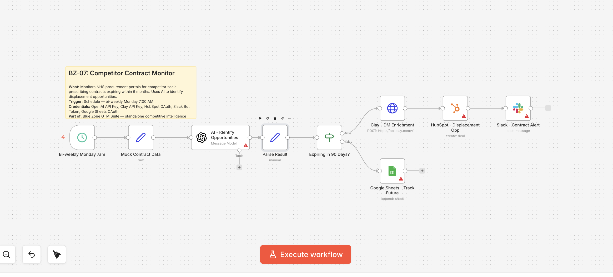
*Competitor Contract Monitor — watches NHS procurement portals for contracts expiring within 90 days*

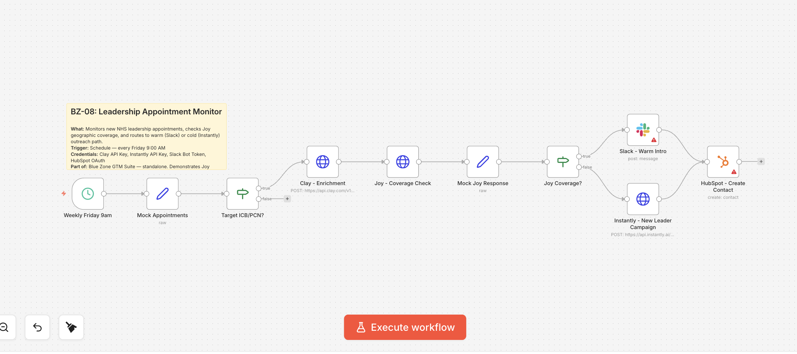
*Leadership Appointment Monitor — detects new Clinical Directors and checks for warm intro opportunities*

### Engagement Pipeline

4 workflows that capture LinkedIn engagement in real-time and batch, enrich through Clay, deduplicate in HubSpot, and route by ICP score to the right campaign — hot signals get priority outbound, warm signals get standard sequences, everyone else gets nurtured.

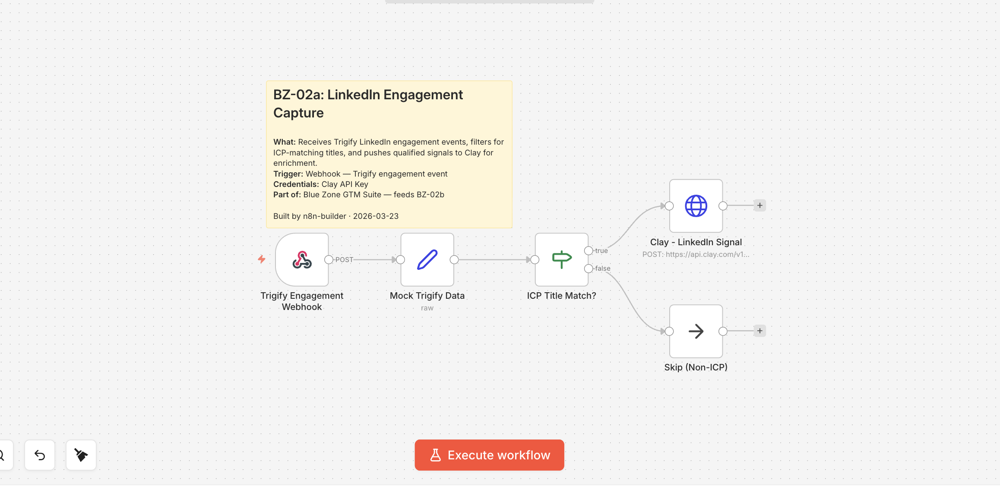
*LinkedIn Engagement Capture — real-time Trigify webhook filters for ICP title match and pushes to Clay*

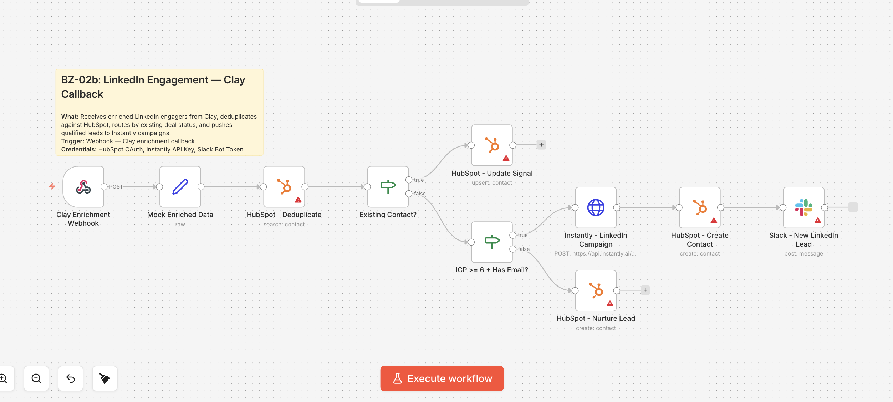
*LinkedIn Engagement Clay Callback — deduplicates, scores by ICP fit, and routes to Hot / Warm / Nurture campaigns*

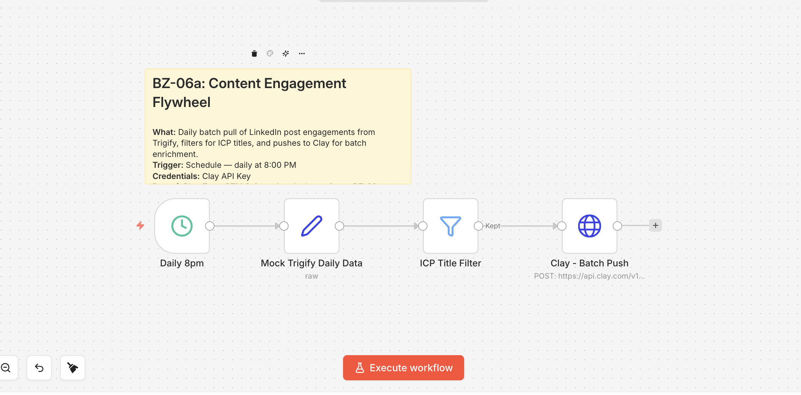
*Content Engagement Flywheel — daily batch pull from Trigify, filters for ICP titles, pushes to Clay*

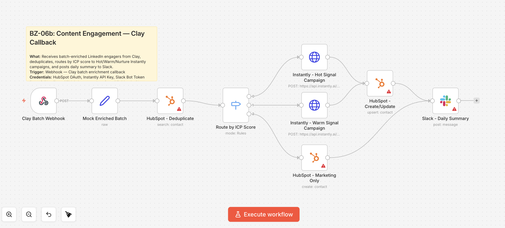
*Content Engagement Clay Callback — routes enriched engagers by ICP score to Instantly campaigns or HubSpot nurture*

### Reply Management

The workflow I'm most proud of. When someone replies to a cold email, AI reads the reply and classifies it into one of six categories — then takes completely different actions for each:

| Reply Type | What Happens Automatically |
|-----------|---------------------------|
| **Interested** | Urgent Slack alert. Deal created in CRM. Removed from sequence. |
| **Objection** | Team notified for manual response. Sequence paused. |
| **Not Now** | Tagged for re-engagement in 60 days. Removed from campaign. |
| **Wrong Person** | Company re-enriched. The *actual* decision-maker found and added to a new campaign. |
| **Unsubscribe** | Removed from everything. Marked "Do Not Contact." |
| **Auto-Reply** | No action. Sequence continues. |

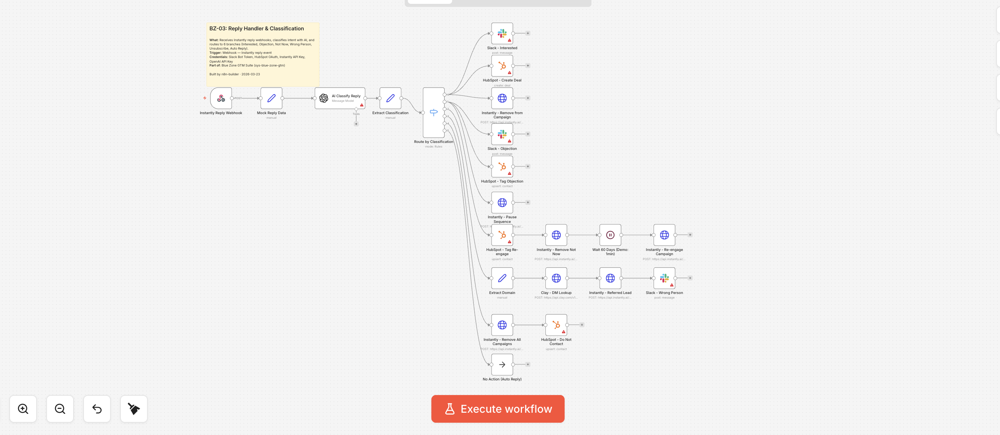
*Reply Handler — AI classifies every inbound reply and routes to 6 different action paths*

### Pilot Lifecycle

4 workflows that manage everything from the moment a client signs a pilot — onboarding kickoff, weekly health checks against benchmarks, strategically timed milestone emails, and AI-generated case studies on completion.

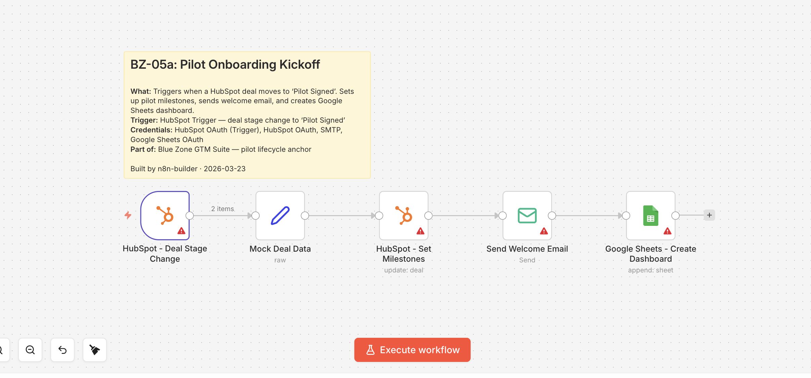
*Pilot Kickoff — triggers on deal stage change, sets milestones, sends welcome email, creates dashboard*

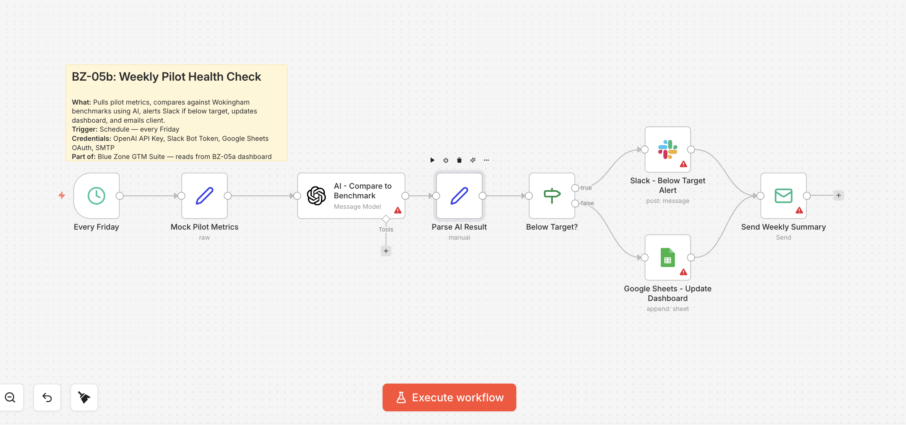
*Weekly Health Check — every Friday, AI compares metrics against benchmarks, alerts if below target*

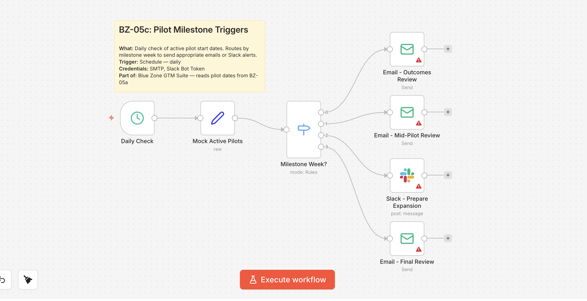
*Milestone Triggers — routes to Week 4 outcomes review, Week 8 mid-pilot review, Week 10 expansion prep, or Week 12 final review*

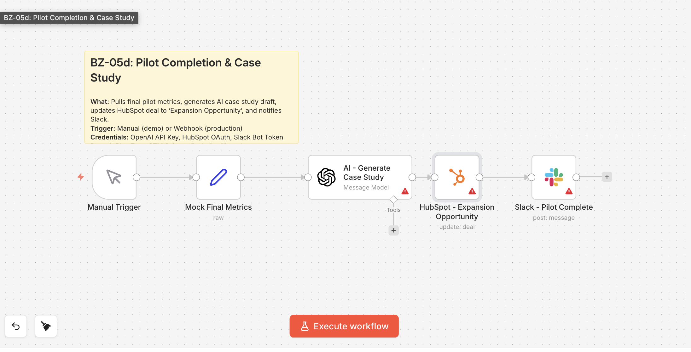
*Pilot Completion — AI generates case study from pilot data, moves deal to Expansion Opportunity*

---

## AI Campaign Orchestration

> [ICP scoring approach](docs/scoring-criteria.md) · [Email methodology](docs/copy-framework.md)

I built an AI orchestration layer using Claude Code that turns campaign deployment from a multi-hour process into a 5-minute conversation. A single instruction file tells Claude Code which tools to use, which strategy documents to read, and which rules to follow.

```
Step 1: Score Companies
  "Score these 200 companies against our ICP"
  → Reads the scoring rubric, scores across 5 dimensions,
    assigns tiers (T1/T2/T3/Disqualified)

Step 2: Find Decision-Makers
  "Find VP-level contacts at our Tier 1 companies"
  → Searches for matching contacts, returns persona breakdown

Step 3: Get Contact Info
  "Find work emails for all contacts"
  → Enriches contacts with verified work emails

Step 4: Write Email Sequences
  "Write a 3-email sequence using the workforce gap angle"
  → Reads the copy framework, generates on-brand sequences
    following word count, tone, and CTA rules

Step 5: Deploy Campaign
  "Load this into our email platform as a draft"
  → Creates the campaign with sequences, loads all leads,
    sets sending schedule — ready for human review
```

The scoring criteria and copy framework act as the "source of truth" — change the documents and the AI adapts. No code changes needed.

---

## Results Framework

All 15 workflows are structurally complete and demo-ready. The metrics below represent what this system is designed to achieve:

| Metric | Target |
|--------|--------|
| Emails sent/day | 50-75 (by Month 2) |
| Open rate | 45%+ |
| Positive reply rate | 5-8% |
| Demos booked/month | 15-20 |
| Champions identified | 6-10 by Day 60 |
| Pilots signed | 2-3 by Day 90 |
| Pipeline value | £200K+ by Day 90 |
| Signal-to-outreach time | Under 24 hours for Tier 1 signals |
| Time to deploy a campaign | Under 5 minutes (with AI orchestration) |

---

## Tech Stack

| Layer | Tool | Role | Monthly Cost |
|-------|------|------|-------------|
| Data & Enrichment | Clay | Lead scoring, enrichment, personalisation | ~£100 |
| Orchestration | n8n | Workflow automation, signal routing, reply handling | Free-£20 |
| Email Delivery | Instantly | Sending, warmup, inbox rotation | ~£80 |
| CRM | HubSpot (Free) | Pipeline tracking, deal management | £0 |
| Social | LinkedIn | Content, engagement, manual outreach | £0 |
| AI Orchestration | Claude Code | Campaign deployment, copy generation | ~£20 |
| Signal Capture | Trigify | LinkedIn engagement detection | ~£50 |
| **Total** | | | **~£270-350/month** |

---

## Documentation

| Document | What's Inside |
|----------|--------------|
| [GTM Strategy](docs/strategy.md) | ICP definition, channel strategy, signal intelligence, pipeline model, 30/60/90 roadmap, pricing, metrics |
| [Automation Architecture](docs/automation-architecture.md) | All 15 workflows explained in plain English — what they do, why they matter, how they connect |
| [Pilot Playbook](docs/pilot-playbook.md) | Pre-pilot checklists, 12-week execution plan, metrics dashboard, expansion playbook |
| [ICP Scoring Approach](docs/scoring-criteria.md) | 5-dimension scoring framework, tier thresholds, and how AI applies it automatically |
| [Email Methodology](docs/copy-framework.md) | Writing rules, sequence structure, and the principles behind high-performing cold email |

---

## About

This GTM engine was designed for a UK healthtech company launching an AI-powered product into the NHS social prescribing market. The system covers everything from finding the first lead to generating a case study after a successful pilot — built to be operated by a single founding GTM hire working directly with the founder.

Want to talk about GTM strategy, automation, or how I'd build something like this for your company? Reach out.
